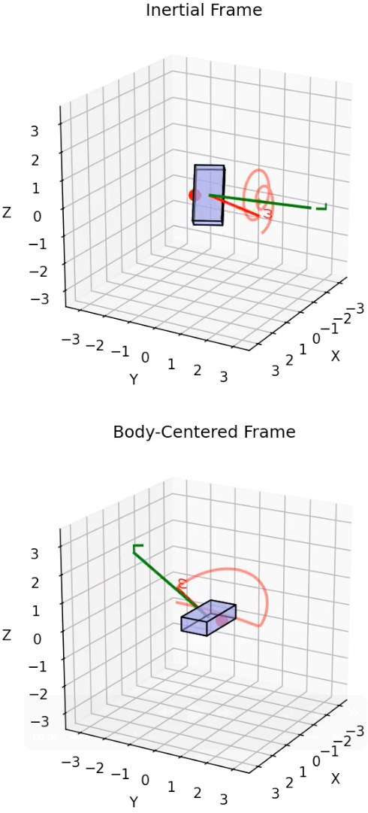

# Free Rigid Body Rotation Visualizer


This Python script numerically integrates and animates the torque-free rotation of a rigid body with three unequal principal moments of inertia. It's ideal for illustrating precession, the tennis-racket instability, and other classical rigid-body behaviors — using straightforward numerical integrations of the equations of motion.



*Example output showing torque-free rotation about the intermediate (unstable) axis. The red arrow shows angular velocity ω, the green arrow shows conserved angular momentum L, and the red trail traces ω's path in space.*

## ⚙️ Command-Line Flags Summary

Run the program as:

```bash
python rigid_rotor.py [flags]
```

| Flag | Type / Values | Default | Description |
|------|---------------|---------|-------------|
| `--I I1 I2 I3` | floats | `1.0 4.0 4.9` | Principal moments of inertia about the body axes. |
| `--dims AX BY CZ` | floats | auto-calculated | Dimensions of the visualized box along its principal axes. Automatically calculated from `--I` to match a uniform-density box unless explicitly specified. |
| `--w0 W1 W2 W3` | floats | — | Initial angular velocity components in the body frame. |
| `--stable1` | flag | — | Spin mostly about the smallest-inertia axis (stable). |
| `--unstable` | flag | — | Spin mostly about the middle-inertia axis (unstable). |
| `--stable3` | flag | — | Spin mostly about the largest-inertia axis (stable). |
| `--mag` | float | `10.0` | Base spin magnitude for the preset flags above. |
| `--tmax` | float | `10.0` | Total simulated time (seconds). |
| `--fps` | int | `60` | Frames per second for animation. |
| `--outfile` | string | — | Optional MP4 filename to save animation (requires ffmpeg). |
| `--vecscale` | float | `0.2` | Scales the length of the ω and L arrows. |
| `--traillen` | int | `100` | Number of recent frames used for the ω trail (red line showing ω's path in space). |

### Example usages

```bash
# Stable rotation about smallest inertia axis
python rigid_rotor.py --stable1

# Tennis-racket instability (middle axis)
python rigid_rotor.py --unstable --tmax 15

# Custom initial spin
python rigid_rotor.py --w0 0 10 0 --I 2 3 4

# Larger arrows, longer ω trail, and saved output
python rigid_rotor.py --unstable --vecscale 0.3 --traillen 200 --outfile tumble.mp4
```

## 1. Physical Model

### 1.1 Euler's equations (body frame)

The body-frame angular velocity components **ω** = (ω₁, ω₂, ω₃) obey the torque-free Euler equations:

```
dω₁/dt = ((I₂ - I₃) / I₁) * ω₂ * ω₃
dω₂/dt = ((I₃ - I₁) / I₂) * ω₃ * ω₁
dω₃/dt = ((I₁ - I₂) / I₃) * ω₁ * ω₂
```

where I₁, I₂, and I₃ are the principal moments of inertia about the body's principal axes.

Angular momentum is conserved:

```
L_body = (I₁ * ω₁, I₂ * ω₂, I₃ * ω₃)
dL/dt = 0
```

### 1.2 Orientation of the body

The program integrates the body axes expressed in space directly.

Let **e₁**(t), **e₂**(t), **e₃**(t) be the body's principal axes written in the space (lab) frame.

Initially:

```
e₁ = (1, 0, 0)
e₂ = (0, 1, 0)
e₃ = (0, 0, 1)
```

Each axis evolves according to:

```
deᵢ/dt = ω_space × eᵢ
```

where **ω_space** = R * **ω_body** and R(t) = [**e₁** **e₂** **e₃**] is the 3×3 matrix whose columns are the body axes in space coordinates.

Thus, the state we integrate is:

- **ω_body**(t): 3 numbers
- **e₁**(t), **e₂**(t), **e₃**(t): 9 numbers
- **Total** = 12 variables.

Because of numerical drift, the body axes are periodically re-orthonormalized to remain orthogonal and unit-length.

## 2. Visualization

The animation shows:

- The rigid body, drawn as a rectangular box aligned with its principal axes, rotated into the space frame every frame.
- Hidden surfaces approximated via simple z-sorting.
- The angular velocity vector **ω** drawn in red as a 3D arrow with an arrowhead.
- The angular momentum vector **L** drawn in green as a 3D arrow with an arrowhead.
- A red trail that shows the recent path of **ω** in space over time. The length of that trail (number of frames kept) is set by `--traillen`.

### Interpretation:

- **L** (green) stays nearly fixed in direction (since there is no external torque).
- **ω** (red) moves relative to **L**, except for pure principal-axis rotation.
- The red trail makes it easy to see how **ω** precesses or flips relative to **L**, revealing the tennis-racket instability.

## 3. Examples

```bash
# Stable spin about smallest inertia axis
python rigid_rotor.py --stable1 --tmax 10

# Unstable spin about middle inertia axis (tennis-racket effect)
python rigid_rotor.py --unstable --tmax 15

# Stable spin about largest inertia axis
python rigid_rotor.py --stable3

# Custom inertia tensor and custom initial ω
python rigid_rotor.py --I 2 5 9 --w0 0 30 0
```

## 4. Code Structure

- **`euler_rhs()`**: Implements Euler's equations for dω/dt in the body frame.
- **`rhs_full()`**: Evolves both the angular velocity in the body frame and the body axes in the space frame.
- **`simulate()`**: Uses scipy.integrate.solve_ivp to integrate the ODEs, returning arrays of ω(t) and orientation.
- **`animate_rigid_body()`**: Builds the 3D animation (box, arrows, and ω trail).
- **`build_initial_w()`**: Selects the initial angular velocity from either explicit input (`--w0`) or preset flags (`--stable1`, `--unstable`, `--stable3`).
- **`parse_args()`**: Defines and parses all command-line flags.
- **`main()`**: Integrates and animates the result.

## 5. Dependencies

Install the required Python packages:

```bash
pip install numpy scipy matplotlib
```

To save animations to MP4 with `--outfile`, install ffmpeg:

```bash
# Linux
sudo apt install ffmpeg

# macOS (Homebrew)
brew install ffmpeg
```

If ffmpeg isn't installed, the animation will still play interactively but won't save to a file.

## 5.5 Testing

The codebase includes a comprehensive verification test suite that validates the physics algorithms and numerical stability. The test suite includes 24 tests covering:

- **Euler equations**: Pure spin tests, symmetry verification
- **Conservation laws**: Energy, angular momentum magnitude and direction
- **Rotation matrices**: Orthogonality, right-handedness
- **Stability**: Stable axes (1 & 3), unstable axis (2) with tennis-racket effect
- **Special cases**: Spherical and axially symmetric tops
- **Numerical integration**: Long-term stability and conservation

### Running Tests Locally

```bash
# Install pytest
pip install pytest

# Run all tests
pytest test_rigid_rotor.py -v

# Run with coverage
pip install pytest-cov
pytest test_rigid_rotor.py --cov=rigid_rotor --cov-report=term-missing
```

### Continuous Integration

Tests run automatically via GitHub Actions on every push and pull request, ensuring code quality. See `TESTING.md` for detailed documentation of the test suite.

## 6. Interpretation and Physics Takeaways

- The **green arrow** (**L**) is the total angular momentum vector in the space frame. It stays fixed in direction and magnitude since no external torques act.
- The **red arrow** (**ω**) is the instantaneous angular velocity vector in the space frame. It is not generally parallel to **L** except for pure principal-axis rotation.
- The **red trail** shows the recent path of **ω** in space, illustrating precession and instability.
- The body tumbles around the fixed **L** direction while conserving both energy and angular momentum.

## 7. Notes and Limitations

- Hidden-surface rendering uses simple depth sorting, sufficient for convex boxes.
- The body axes are periodically re-orthonormalized to prevent floating-point drift.
- This simulates only torque-free motion: no damping, no gravity-gradient, no external forces.
- The preset flags (`--stable1`, `--unstable`, `--stable3`) map directly to axes 1, 2, and 3 as given in `--I`; they are not automatically sorted by inertia magnitude.

## 8. TL;DR

Run this:

```bash
python rigid_rotor.py --unstable
```

- **Red arrow**: angular velocity (**ω**)
- **Green arrow**: angular momentum (**L**), constant direction
- **Red trail**: recent motion of **ω**

This is a direct visualization of torque-free rigid body motion — no quaternions, no Euler angles, just vectors, cross products, and physics.
